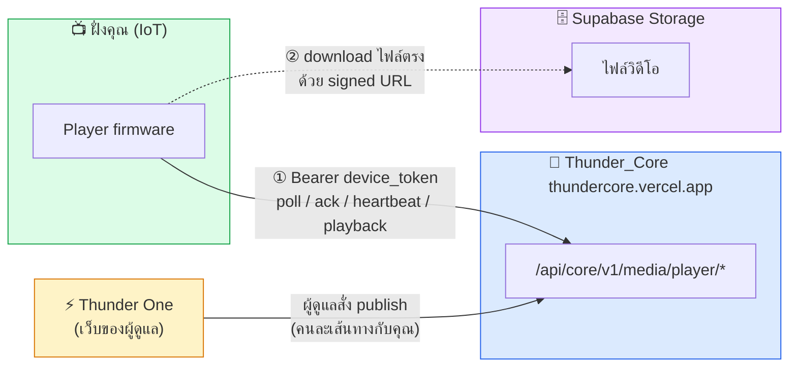
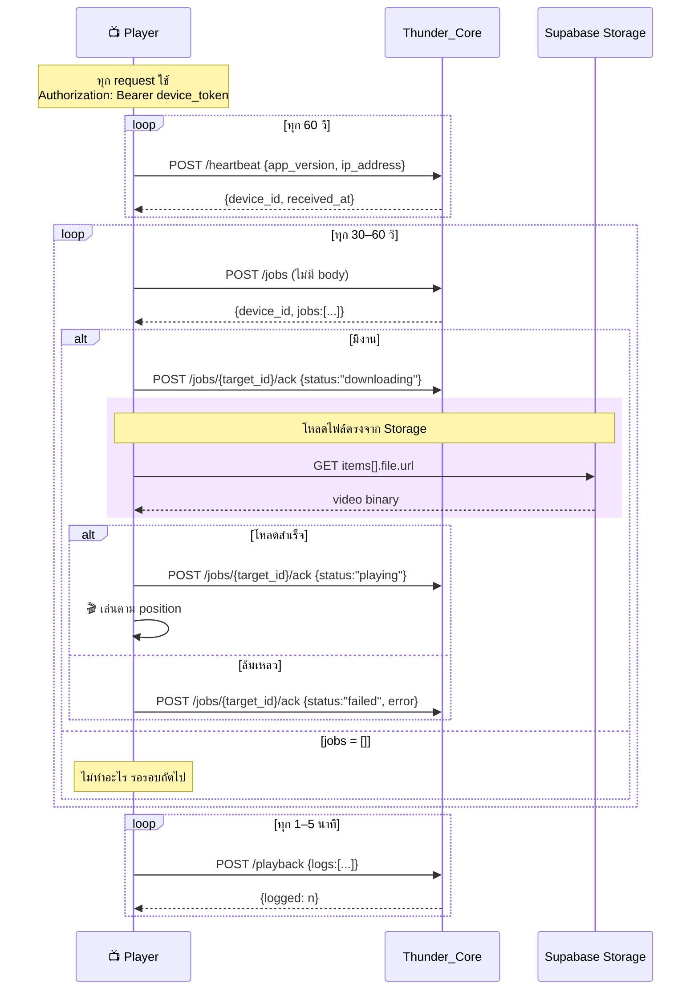
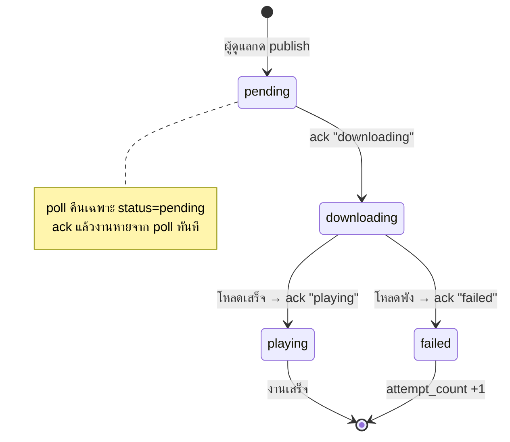

# Thunder One — Player/Device API Contract (สำหรับทีม IoT)

เอกสารสำหรับทีมที่พัฒนาเครื่องเล่น (player firmware) ยิงเข้า Thunder Core API

> **สถานะ:** ✅ deploy บน production แล้ว — ทดสอบยิงจริงผ่าน 2026-07-24 (ผลการทดสอบอยู่ท้ายเอกสาร §8)
> อ้างอิงจาก source จริงของ Thunder_Core (`media/player/*` + migration `049_media_core_functions.sql`)

---

## 0. ก่อนเริ่ม

### Base URL

```
https://thundercore.vercel.app
```

### Authentication

ทุก endpoint ใช้ **device token** อย่างเดียว:

```http
Authorization: Bearer <device_access_token>
```

- token ได้จากทีม Thunder (1 เครื่อง = 1 token) — ดูชุดทดสอบใน §7
- **ห้ามใช้ `x-api-key`** — นั่นเป็นของฝั่ง web app คนละชุดกัน
- token ผิด / ถูก revoke → `401 Unauthorized: invalid or revoked device token`
- **ไม่ต้องส่ง device_id ใด ๆ ใน body** — server resolve เองจาก token

### Response envelope

สำเร็จ (HTTP 200): `{ "success": true, "data": { ... } }`
ผิดพลาด (4xx/5xx): `{ "error": "ข้อความอธิบาย" }`

| HTTP | เกิดเมื่อ |
|------|-----------|
| 400 | body ผิด schema (ข้อความขึ้นต้น `Invalid input:`) |
| 401 | ไม่มี token / token ผิด / ถูก revoke |
| 404 | ไม่พบ resource (เช่น ack target ที่ไม่ใช่ของเครื่องนี้) |
| 405 | ใช้ method ผิด — **ทุกเส้นเป็น POST** |
| 500 | error ฝั่ง server |

ทุก request ที่มี body ต้องส่ง `Content-Type: application/json`

---

## 1. ตำแหน่งของเครื่องเล่นในระบบ



**สิ่งที่ทีม IoT ต้องรู้:**

1. **คุณคุยกับ Thunder_Core ตรง** ไม่ผ่านเว็บ Thunder One
2. **ไฟล์วิดีโอไม่วิ่งผ่าน API** — API ให้แค่ signed URL แล้วคุณโหลดตรงจาก Supabase Storage
3. **เป็นระบบ pull** — server ไม่ push หาเครื่อง คุณต้อง poll เอง

---

## 2. สรุปเส้น API (4 เส้น — POST ทั้งหมด)

| # | Path | หน้าที่ | ความถี่ |
|---|------|---------|---------|
| 1 | `/api/core/v1/media/player/jobs` | ดึงงานที่ต้องเล่น | ทุก 30–60 วิ |
| 2 | `/api/core/v1/media/player/jobs/{target_id}/ack` | รายงานสถานะงาน | ทุกครั้งที่สถานะเปลี่ยน |
| 3 | `/api/core/v1/media/player/heartbeat` | บอกว่าเครื่องออนไลน์ | ทุก 60 วิ |
| 4 | `/api/core/v1/media/player/playback` | ส่ง log การเล่น | batch ทุก 1–5 นาที |

---

## 3. วงจรการทำงาน (Sequence)



### State ของงานหนึ่งชิ้น



> ⚠️ **สำคัญ:** poll คืนเฉพาะงานที่ `status = 'pending'` — พอ ack `downloading` ไปแล้วงานจะ**หายจาก poll ทันที** ถ้าเครื่องรีบูตกลางคัน งานนั้นจะไม่กลับมาอีก **ต้องเก็บ state ของงานไว้ใน local storage ของเครื่องด้วย**

---

## 4. รายละเอียดแต่ละเส้น

### 4.1 Poll งาน — `POST /media/player/jobs`

```http
POST /api/core/v1/media/player/jobs
Authorization: Bearer <device_token>
```
ไม่ต้องมี body

**Response 200** (ตัวอย่างจริงจาก production):

```json
{
  "success": true,
  "data": {
    "device_id": "11110000-0000-4000-8000-000000000011",
    "jobs": [
      {
        "target_id": "806c2265-e008-4b91-b199-532fde7a46ed",
        "publication_id": "5a4662a2-4aa2-49fe-9e76-07a22377f331",
        "created_at": "2026-07-24T04:56:36.283141+00:00",
        "playlist": { "id": "48ea7acc-...", "name": "test" },
        "items": [
          {
            "media_asset_id": "a5624df1-3c63-4c2a-b98a-365cca0e1891",
            "position": 0,
            "duration_seconds": 10,
            "transition": "cut",
            "file": {
              "bucket_name": "media",
              "storage_key": "videos/db2b1bcf-....mp4",
              "checksum": null,
              "mime_type": "video/mp4",
              "original_filename": "sample-360p-10s.mp4",
              "url": "https://sfiefevtxalqjizdkcsw.supabase.co/storage/v1/object/sign/media/...?token=..."
            }
          }
        ]
      }
    ]
  }
}
```

| ฟิลด์ | ชนิด | หมายเหตุ |
|-------|------|----------|
| `jobs` | array | ว่าง `[]` ถ้าไม่มีงานใหม่ — **ไม่ใช่ error** |
| `jobs[].target_id` | uuid | **ใช้ตัวนี้ตอน ack** (ไม่ใช่ `publication_id`) |
| `items` | array | เรียงตาม `position` แล้ว |
| `items[].position` | int | **เริ่มที่ 0** |
| `items[].duration_seconds` | int | เวลาที่ต้องแสดง |
| `items[].file.url` | string \| null | **signed URL — อายุ 1 ชั่วโมง** |
| `items[].file.checksum` | string \| null | **อาจเป็น null** — ถ้ามีค่อยใช้ตรวจไฟล์ |

> ⚠️ `file.url` หมดอายุใน 1 ชม. โหลดไม่ทันต้อง poll ใหม่ **ห้าม cache ข้ามวัน**
> `url` เป็น `null` ได้ถ้าสร้าง signed URL ไม่สำเร็จ → ack `failed`

---

### 4.2 รายงานสถานะ — `POST /media/player/jobs/{target_id}/ack`

```http
POST /api/core/v1/media/player/jobs/806c2265-e008-4b91-b199-532fde7a46ed/ack
Authorization: Bearer <device_token>
Content-Type: application/json
```
```json
{ "status": "downloading", "error": null }
```

| ฟิลด์ | บังคับ | ค่าที่รับ |
|-------|--------|-----------|
| `status` | ✅ | `downloading` \| `playing` \| `failed` **เท่านั้น** |
| `error` | ไม่ | ข้อความ error — บันทึกเฉพาะตอน `failed` |

- `downloading` — รับงานแล้ว กำลังโหลด
- `playing` — โหลดเสร็จ กำลังเล่น (= งานสำเร็จ)
- `failed` — ทำไม่สำเร็จ (ระบบ `attempt_count + 1`)

**Response 200:** `{ "success": true, "data": null }`

| กรณี | ผลลัพธ์ |
|------|---------|
| `status` ไม่อยู่ใน 3 ค่า | 400 `Invalid input: status must be downloading, playing or failed` |
| `target_id` ไม่ใช่ของเครื่องนี้ | 404 `not found: job target not found for this device` |

---

### 4.3 Heartbeat — `POST /media/player/heartbeat`

```json
{ "app_version": "1.4.2", "ip_address": "192.168.1.50" }
```

ทั้งสองฟิลด์ **optional** ส่ง `{}` ก็ได้ (ไม่ส่งฟิลด์ไหน ค่าเดิมคงอยู่ ไม่ถูกล้าง)

**Response 200:**
```json
{ "success": true, "data": { "device_id": "1111...0011", "received_at": "2026-07-24T07:18:16.030661+00:00" } }
```

ผลข้างเคียง: ระบบตั้ง `connection_status = 'online'` + อัปเดต `last_heartbeat_at`

---

### 4.4 Playback Log — `POST /media/player/playback`

```json
{
  "logs": [
    {
      "media_asset_id": "a5624df1-3c63-4c2a-b98a-365cca0e1891",
      "played_at": "2026-07-24T04:10:00.000Z",
      "duration_played_seconds": 10
    }
  ]
}
```

| ฟิลด์ | บังคับ | หมายเหตุ |
|-------|--------|----------|
| `logs` | ✅ | array (ว่างได้) |
| `media_asset_id` | ✅ | ต้องเป็น uuid ที่ถูกต้อง ไม่งั้น 400 |
| `played_at` | ✅ | ISO 8601 |
| `duration_played_seconds` | ✅ | **จำนวนเต็ม** (ไม่รับทศนิยม) |

**Response 200:** `{ "success": true, "data": { "logged": 1 } }`

> ⚠️ `logged` อาจน้อยกว่าที่ส่งไป — ระบบบันทึกเฉพาะ `media_asset_id` ที่เป็นของ tenant เดียวกับเครื่องนี้ รายการที่ไม่ตรงถูก**ทิ้งเงียบ ๆ ไม่ error** ถ้าตัวเลขไม่ตรงควร log ฝั่งเครื่องไว้ตรวจ

---

## 5. ข้อควรระวัง (สรุป)

1. **signed URL อายุ 1 ชม.** — โหลดไม่ทัน/เน็ตหลุด ให้ poll ใหม่
2. **ack ด้วย `target_id` ไม่ใช่ `publication_id`** — ผิดตัวได้ 404
3. **ack แล้วงานหายจาก poll** → ต้องเก็บ state ฝั่งเครื่อง
4. **ทุก endpoint เป็น POST** รวมถึง poll (ยิง GET ได้ 405)
5. **`position` เริ่มที่ 0**, **`checksum` อาจเป็น null**
6. **เก็บ token ให้ปลอดภัย** — ใครได้ไปก็ปลอมเป็นเครื่องนี้ได้ เครื่องหายให้แจ้ง Thunder revoke

---

## 6. ตัวอย่าง curl

```bash
TOKEN="dtk_6625464d12389e2235c325738ba6dbde3bf7f4edd55d6c80"
BASE="https://thundercore.vercel.app"

# 1. poll งาน
curl -X POST "$BASE/api/core/v1/media/player/jobs" \
  -H "Authorization: Bearer $TOKEN"

# 2. ack ว่ากำลังโหลด
curl -X POST "$BASE/api/core/v1/media/player/jobs/806c2265-e008-4b91-b199-532fde7a46ed/ack" \
  -H "Authorization: Bearer $TOKEN" -H "Content-Type: application/json" \
  -d '{"status":"downloading"}'

# 3. heartbeat
curl -X POST "$BASE/api/core/v1/media/player/heartbeat" \
  -H "Authorization: Bearer $TOKEN" -H "Content-Type: application/json" \
  -d '{"app_version":"1.0.0","ip_address":"192.168.1.50"}'

# 4. playback log
curl -X POST "$BASE/api/core/v1/media/player/playback" \
  -H "Authorization: Bearer $TOKEN" -H "Content-Type: application/json" \
  -d '{"logs":[{"media_asset_id":"a5624df1-3c63-4c2a-b98a-365cca0e1891","played_at":"2026-07-24T04:10:00Z","duration_played_seconds":10}]}'
```

---

## 7. ชุดข้อมูลทดสอบสำหรับ POC

> 🔐 **token ด้านล่างเป็น credential จริงของเครื่องทดสอบ** — ใช้เฉพาะ POC ห้าม commit ลง public repo
> เสร็จ POC แล้วแจ้งทีม Thunder ให้ revoke แล้วออกชุดใหม่สำหรับ production

**Base URL:** `https://thundercore.vercel.app`
**Tenant:** ThunderOne (`11110000-0000-4000-8000-000000000001`)

### เครื่องทดสอบ 2 เครื่อง

| เครื่อง | device_id | device token | สถานะข้อมูล |
|--------|-----------|--------------|-------------|
| **ThunderOne Screen 01** | `11110000-0000-4000-8000-000000000011` | `dtk_6625464d12389e2235c325738ba6dbde3bf7f4edd55d6c80` | ✅ **มีงาน pending รออยู่** — ใช้เครื่องนี้เทส flow เต็ม |
| **ThunderOne Screen 02** | `11110000-0000-4000-8000-000000000012` | `dtk_d92b8fbab4fc461aaea04f3b5137b1a6121d4c0f7cfc2495` | ไม่มีงาน — ใช้เทสเคส `jobs: []` |

### งานที่รออยู่บน Screen 01

| ข้อมูล | ค่า |
|-------|-----|
| `target_id` (ใช้ ack) | `806c2265-e008-4b91-b199-532fde7a46ed` |
| `publication_id` | `5a4662a2-4aa2-49fe-9e76-07a22377f331` |
| `playlist` | `48ea7acc-6161-4900-b89a-be2cc084f488` ("test") |
| `media_asset_id` (ใช้ playback log) | `a5624df1-3c63-4c2a-b98a-365cca0e1891` |
| ไฟล์ | `sample-360p-10s.mp4` · video/mp4 · 10 วินาที |

### ลำดับการเทส POC ที่แนะนำ

1. **heartbeat** ด้วย token Screen 01 → ต้องได้ 200 + `device_id`
2. **poll jobs** → ต้องได้ 1 job พร้อม `file.url`
3. **โหลดไฟล์** จาก `file.url` → ต้องได้ mp4 ~1MB
4. **ack `downloading`** ด้วย `target_id` → 200
5. **ack `playing`** → 200
6. **poll ซ้ำ** → คราวนี้ต้องได้ `jobs: []` (งานถูก ack แล้ว)
7. **playback log** ด้วย `media_asset_id` → ต้องได้ `{"logged": 1}`
8. **เทส token ผิด** → ต้องได้ 401

> ⚠️ **ข้อ 5 ทำให้งานหายถาวร** — พอ ack `playing` แล้ว poll จะว่าง อยากได้งานใหม่มาเทสอีกรอบ ให้แจ้งทีม Thunder สั่ง publish ใหม่ (หรือใช้ Screen 02 เทสเคสว่างไว้ก่อน)

---

## 8. ผลทดสอบ production (ยืนยันแล้ว 2026-07-24)

ทีม Thunder ยิงจริงกับ production ผ่านทั้งหมด:

| เทส | ผลลัพธ์ |
|-----|---------|
| `POST /media/player/jobs` (Screen 01) | ✅ **200** — คืน 1 job + signed URL ใช้งานได้ |
| `POST /media/player/heartbeat` | ✅ **200** — `{device_id, received_at}` |
| token ผิด | ✅ **401** `Unauthorized: invalid or revoked device token` |
| `GET` แทน `POST` | ✅ **405** (ยืนยันว่าทุกเส้นรับเฉพาะ POST) |

แปลว่า **endpoint พร้อมใช้งาน** ถ้าฝั่งเครื่องยิงแล้วไม่ผ่าน ให้ตรวจ header `Authorization: Bearer` และ method ก่อน

---

## 9. สิ่งที่ระบบยังไม่รองรับ (ต้องคุยกันถ้าจำเป็น)

- **ไม่มี job ประเภท "revoke"/"stop"** — ยังไม่มีคำสั่งบอกเครื่องให้หยุดเล่น publication ที่หมดอายุ/ถูกยกเลิก ฝั่งเครื่องต้องตัดสินใจเองว่าจะเล่นของเดิมค้างไว้หรือไม่
- **ไม่มี endpoint ให้เครื่อง refresh token เอง** — token คงที่จนกว่าจะถูก revoke
- **ยังไม่กำหนดพฤติกรรมเมื่อ offline นาน** — เครื่องควร cache playlist ล่าสุดเล่นต่อ หรือขึ้นจอดำ ยังไม่มีข้อตกลง
- **ไม่มี endpoint ให้เครื่องดึง playlist ปัจจุบัน** — รู้ได้จาก job ตอน poll เท่านั้น ถ้าพลาดไปต้องรอ publish รอบใหม่
