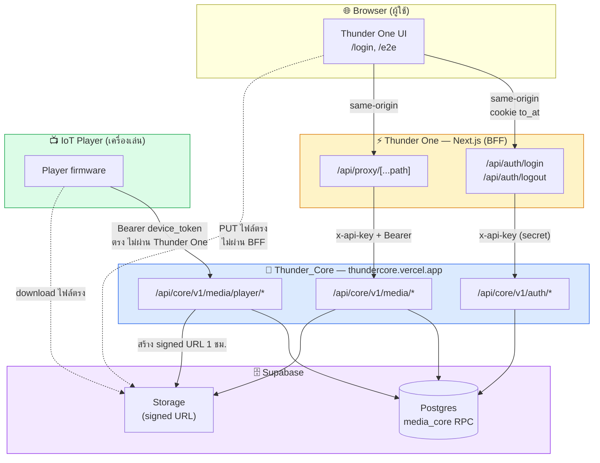
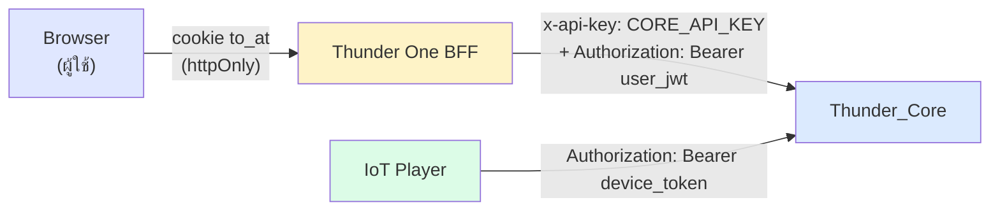
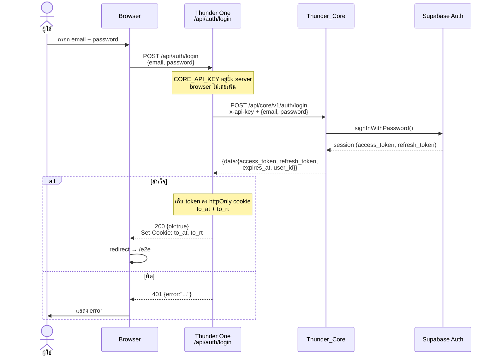
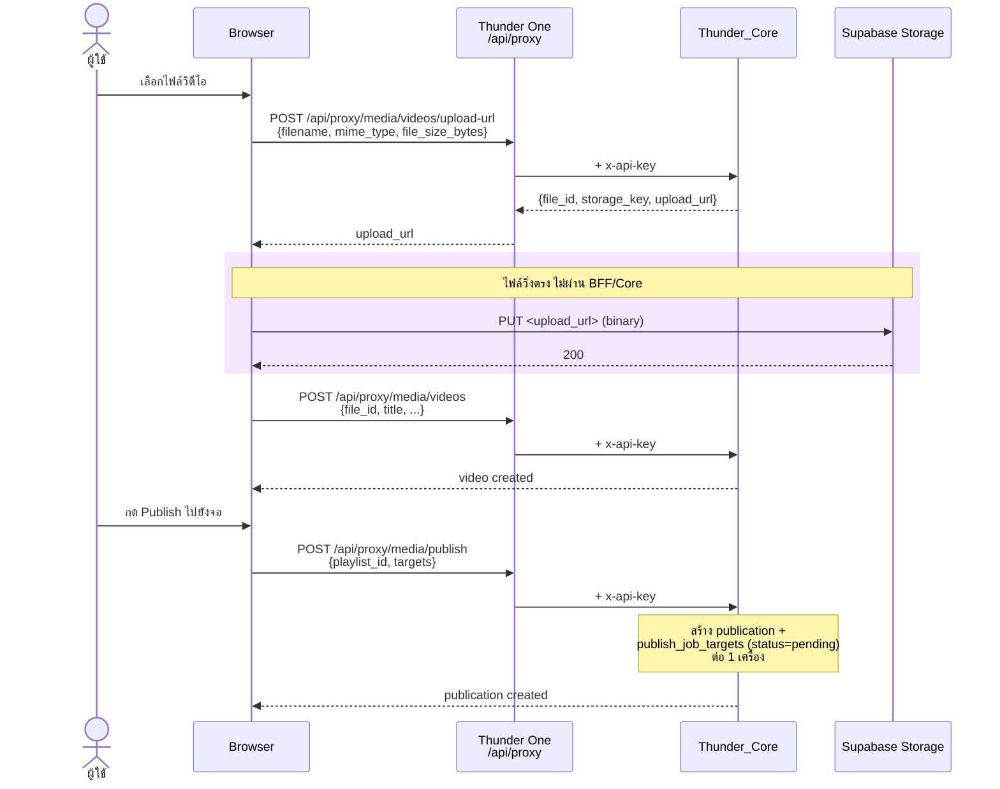
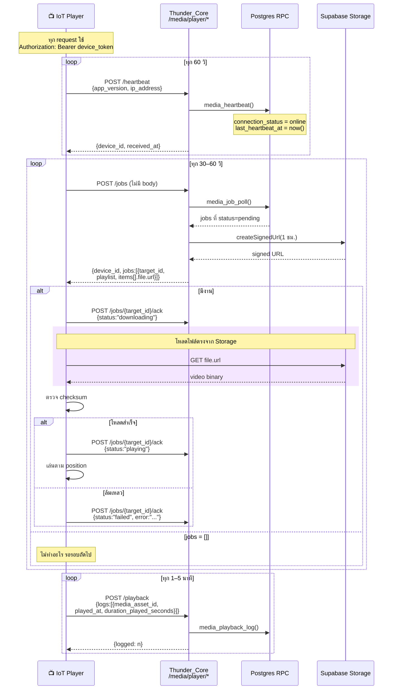
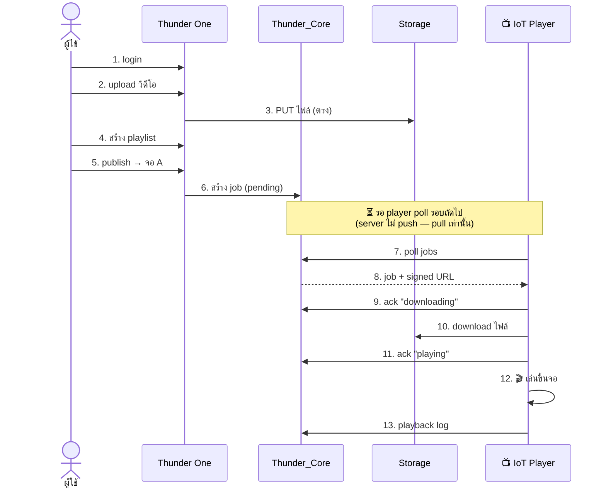

# Thunder One — System Flow

แผนภาพการติดต่อระหว่าง **Thunder One** (frontend), **Thunder_Core** (backend), และ **IoT Player** (เครื่องเล่น)

> อ้างอิงจาก code จริง ณ 2026-07-24 — media routes deploy ขึ้น production แล้ว

---

## 1. ภาพรวมระบบ — ใครคุยกับใคร

### จุดสำคัญ 3 ข้อ

1. **IoT ไม่คุยกับ Thunder One เลย** — ยิงตรงเข้า Thunder_Core ด้วย device token คนละเส้นทางกับฝั่ง web ทั้งหมด
2. **ไฟล์วิดีโอไม่วิ่งผ่าน BFF หรือ Thunder_Core** — ทั้ง upload และ download คุยกับ Supabase Storage ตรงผ่าน signed URL
3. **Thunder One เป็น BFF** — browser ไม่เคยเห็น `CORE_API_KEY` และไม่เคยเห็น JWT (อยู่ใน httpOnly cookie)

---

## 2. ใครใช้ auth แบบไหน

| ผู้เรียก | Credential | ได้มาจาก | ใช้กับ |
|---------|-----------|---------|--------|
| Browser → BFF | cookie `to_at` (httpOnly) | login สำเร็จ | เส้นทางภายใน Thunder One |
| BFF → Core | `x-api-key` (app identity) | env `CORE_API_KEY` | `/media/*` ทุกเส้น |
| BFF → Core | `Bearer <user_jwt>` (user identity) | Supabase JWT จาก login | แนบเพิ่มเมื่อล็อกอินแล้ว |
| IoT → Core | `Bearer <device_token>` | `device_credentials.access_token` | `/media/player/*` เท่านั้น |

> ⚠️ device token กับ user JWT ใช้ header เดียวกัน (`Authorization: Bearer`) แต่**คนละ token คนละ endpoint** — IoT ห้ามใช้ `x-api-key`

---

## 3. Flow: ผู้ใช้ Login

**หัวใจ:** response ที่กลับไป browser คือ `{ok:true}` เปล่า ๆ — **token ไม่เคยอยู่ใน body** อยู่ใน httpOnly cookie ที่ JS อ่านไม่ได้

---

## 4. Flow: อัปโหลดวิดีโอ + Publish

> เหตุผลที่ proxy ไม่ต้องรองรับ binary — **ไฟล์ไม่เคยวิ่งผ่านมัน** ขอแค่ signed URL แล้ว browser ยิงตรงเข้า Storage

---

## 5. Flow: IoT Player (วงจรหลัก)

---

## 6. End-to-end: จากอัปโหลดจนขึ้นจอ

**Latency ที่ต้องรู้:** ตั้งแต่กด publish ถึงขึ้นจอ = **รอบ poll ถัดไป (30–60 วิ) + เวลาโหลดไฟล์** ไม่ใช่ทันที เพราะเป็นสถาปัตยกรรม pull

---

## 7. สรุปเส้นทางทั้งหมด

| จาก | ไป | Auth | ใช้ทำอะไร |
|-----|----|----|-----------|
| Browser | Thunder One `/api/auth/*` | cookie | login / logout |
| Browser | Thunder One `/api/proxy/*` | cookie | ทุก media operation |
| Browser | Supabase Storage | signed URL | **upload ไฟล์** (ตรง) |
| Thunder One | Thunder_Core `/auth/*` | `x-api-key` | verify credentials |
| Thunder One | Thunder_Core `/media/*` | `x-api-key` + Bearer | CRUD video/screen/playlist/publish |
| IoT Player | Thunder_Core `/media/player/*` | Bearer device_token | poll / ack / heartbeat / playback |
| IoT Player | Supabase Storage | signed URL | **download ไฟล์** (ตรง) |

รายละเอียด contract ฝั่ง IoT → [player_device_api.md](player_device_api.md)
